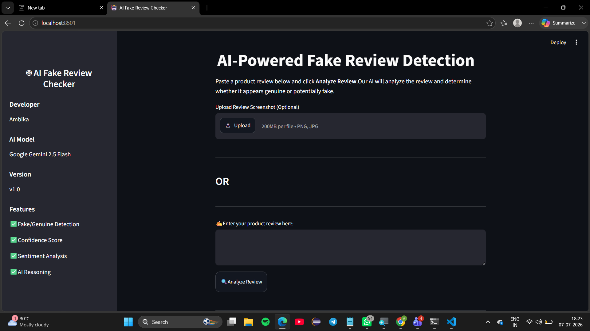
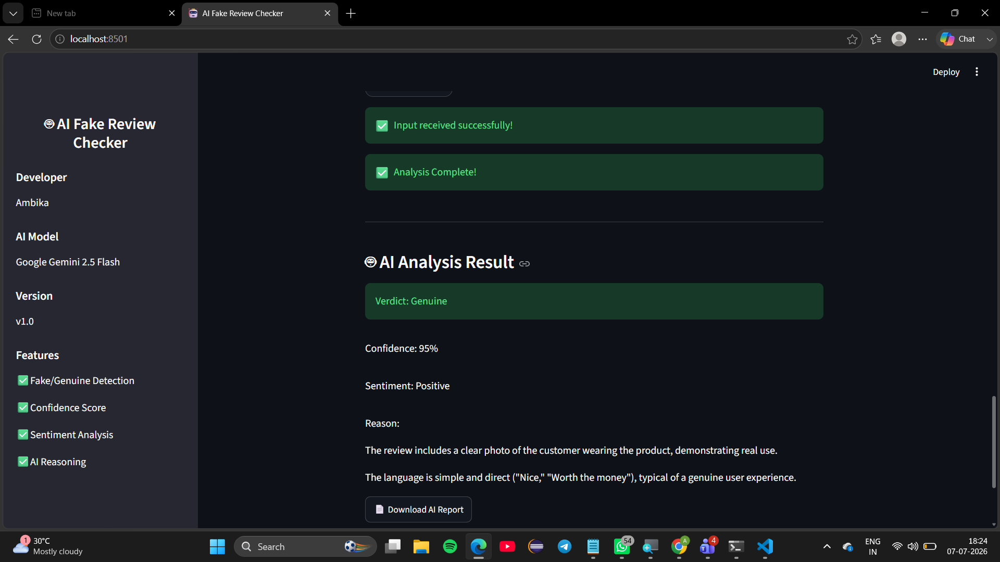

# 🤖 AI Fake Review Checker

An AI-powered web application that detects whether a product review is **Genuine** or **Fake** using **Google Gemini AI**. Users can analyze both text reviews and review screenshots through a simple Streamlit interface.

---

## ✨ Features

- ✅ Detects Fake or Genuine Product Reviews
- 📝 Analyze Text Reviews
- 🖼️ Analyze Review Screenshots
- 🤖 Powered by Google Gemini AI
- 📊 Displays Confidence Score
- 💬 Shows Sentiment Analysis
- 📄 Download Analysis Report
- 🎨 Clean and User-Friendly Interface

---

## 🛠️ Tech Stack

- Python
- Streamlit
- Google Gemini API
- Pillow (PIL)
- Git
- GitHub

---

## 📁 Project Structure

```
AI-Fake-Review-Checker/
│── app.py
│── ai_agent.py
│── config.py
│── requirements.txt
│── README.md
│── .gitignore
│── image/
```

---

## 🚀 Installation

### 1. Clone the repository

```bash
git clone https://github.com/Ambika-1224/AI-Fake-Review-Checker.git
```

### 2. Open the project

```bash
cd AI-Fake-Review-Checker
```

### 3. Install dependencies

```bash
pip install -r requirements.txt
```

### 4. Create a `.env` file

```
GEMINI_API_KEY=YOUR_API_KEY
```

### 5. Run the application

```bash
streamlit run app.py
```

---

## 📷 How to Use

1. Enter a product review **or** upload a review screenshot.
2. Click **Analyze Review**.
3. The AI predicts whether the review is **Genuine** or **Fake**.
4. View the confidence score and sentiment.
5. Download the analysis report if needed.

---

## 📷 Home Screen



---

## 📷 Analysis Result



---

## 📌 Future Improvements

- 🌍 Multi-language Support
- 📂 Batch Review Analysis
- 📈 Analytics Dashboard
- ☁️ Cloud Deployment 
- 🌐 Web Deployement

---

## 👩‍💻 Developer

**Ambika**

GitHub:  
https://github.com/Ambika-1224

---

⭐ If you found this project useful, consider giving it a **Star** on GitHub.